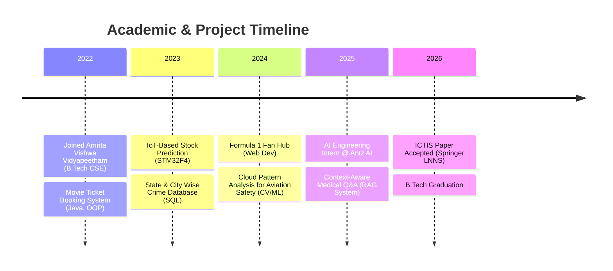

<div align="center">


[](https://git.io/typing-svg)

<br/>

<a href="mailto:sudhakarsadasivam@gmail.com"></a>&nbsp;
<a href="https://www.linkedin.com/in/k-s-sudhakar-75a6052ab/"></a>&nbsp;
<a href="https://github.com/sudhakar-1104"></a>&nbsp;
<a href="https://sudhakar-1104.github.io/"></a>

<br/><br/>

&nbsp;
[](https://github.com/sudhakar-1104)

</div>

---

## 👤 About Me

```yaml
┌─────────────────────────────────────────────────────────────┐
│  name        :  K S Sudhakar                                │
│  location    :  Coimbatore, Tamil Nadu, India               │
│  education   :  B.Tech CSE — Amrita Vishwa Vidyapeetham     │
│  year        :  2022 – 2026                                 │
│  internship  :  AI Engineering Intern @ Antz AI             │
│  focus       :  LLMs · RAG Pipelines · ML · Data Analytics  │
│  email       :  sudhakarsadasivam@gmail.com                 │
│  status      :  Open to SDE / AI Engineering Roles          │
└─────────────────────────────────────────────────────────────┘
```

- 🤖 Built production-grade **LLM-powered RAG pipelines** with vector databases
- 🔬 Passionate about **AI systems, backend engineering & scalable software**
- ✈️ Applied **Computer Vision + ML** for real-world aviation safety use case
- 📡 Hands-on with **Embedded Systems** (STM32F4, UART, GPIO, ADC)
- 🧠 Strong foundation in **DBMS, OS, Networks, Data Analytics, Cryptography & AI**

---

## 🎓 Education

| 🏛️ Institution | 📘 Degree | 📊 Score | 📅 Duration |
|:---|:---|:---:|:---:|
| **Amrita Vishwa Vidyapeetham**, Coimbatore | B.Tech — Computer Science & Engineering | `CGPA: 7.00` | 2022 – 2026 |
| **SBOA Matric. Hr. Sec. School**, Coimbatore | Higher Secondary Certificate (HSC) | `88%` | 2022 |

---

## 💼 Work Experience

### 🤖 AI Engineering Intern — [Antz AI](https://antz.ai)
> **May 2025 – July 2025** &nbsp;|&nbsp; Hybrid

- Developed **LLM-powered Retrieval-Augmented Generation (RAG)** pipelines from scratch
- Integrated **vector databases** for semantic search and context driven query processing
- Performed testing, validation, and **performance optimization** of AI workflows
- Built and shipped scalable, production-oriented AI applications

---

## 📄 Research & Publications
 
### 🧬 Retrieval-Grounded Multimodal Clinical Language Modeling
[]()
[]()
[]()
 
Accepted for publication at **ICTIS 2026 (Springer, Lecture Notes in Networks and Systems)**. Introduced a **multimodal Retrieval-Augmented Generation (RAG) framework** for privacy-preserving clinical Large Language Models, improving factual reliability of generated clinical text — the research foundation behind the *Context-Aware Medical Q&A* project below.


## 🧰 Technical Skills

### 💻 Programming Languages

[](https://skillicons.dev)

### 🤖 AI / ML Stack

[](https://skillicons.dev)

> Additionally: `LlamaIndex` · `Qdrant` · `Agno Agent` · `Ollama / TinyLlama` · `RAG Pipelines` · `Vector Databases` · `Semantic Search`

### ☁️ Cloud & DevOps

[](https://skillicons.dev)

### 🗄️ Databases & Backend

[](https://skillicons.dev)

### 🛠️ Tools & Platforms

[](https://skillicons.dev)

> Additionally: `Jira` · `Microsoft Suite` · `Google Suite` · `STM32CubeIDE`

---

## 🗺️ Journey Timeline
 

 
<sub>Renders automatically on GitHub — no setup needed, native Mermaid support.</sub>

## 🚀 Featured Projects

<table>
<tr>
<td width="50%" valign="top">

### 🩺 Context-Aware Medical Q&A
`Aug 2025 – Present`

[](https://llamaindex.ai)
[](https://qdrant.tech)
[](https://ollama.com)
[]()

Built a medical-domain **RAG pipeline** by ingesting documents with LlamaIndex, storing embeddings in Qdrant, and orchestrating query handling via Agno Agent + TinyLlama for domain-specific responses.

</td>
<td width="50%" valign="top">

### ✈️ Cloud Pattern Analysis — Aviation Safety
`Aug 2024 – Nov 2024`

[]()
[]()
[]()

Implemented a **DIP system** using onboard camera feeds to detect cloud coverage, density, and turbulence potential — providing real-time pilot advisories via ML classification.

</td>
</tr>
<tr>
<td width="50%" valign="top">

### 🏎️ Formula 1 Fan Hub
`Jan 2024 – May 2024`

[](https://skillicons.dev)
[](https://skillicons.dev)
[](https://skillicons.dev)

Designed a **fully responsive frontend** for an F1-based website supporting video streaming and e-commerce — focused on strong UI/UX for fan engagement.

</td>
<td width="50%" valign="top">

### 🔍 State & City Wise Crime Database
`July 2023 – Oct 2023`

[](https://skillicons.dev)
[]()
[]()

Comprehensive **DBMS project** with detailed cyber-crime records for states/cities, CRUD operations, and backend data visualization features.

</td>
</tr>
<tr>
<td width="50%" valign="top">

### 📈 IoT Based Stock Prediction
`Jan 2023 – May 2023`

[](https://skillicons.dev)
[](https://skillicons.dev)
[]()

**STM32F4-based IoT system** with FSR sensors, ADC calibration, UART communication and GPIO-controlled LED indicators for real-time monitoring.

</td>
<td width="50%" valign="top">

### 🎬 Movie Ticket Booking System
`Aug 2022 – Dec 2022`

[](https://skillicons.dev)
[]()

Java OOP application with encapsulation and polymorphism, enabling users to browse movies, select seats, book tickets, and generate confirmations interactively.

</td>
</tr>
</table>

---

## 📊 GitHub Analytics

<div align="center">


&nbsp;


</div>

<div align="center">

[](https://git.io/streak-stats)

</div>

<div align="center">

[](https://github.com/ashutosh00710/github-readme-activity-graph)

</div>

[](https://holopin.io/@sudhakar1104)
---

## 🏅 Certifications & Learning

<div align="center">

| 🎖️ Certification | 🏛️ Issuer | 🏷️ Domain |
|:---|:---|:---:|
| ☁️ **Cloud Foundations: GCP and AWS** | Google / Amazon | Cloud Computing |
| 🛡️ **Introduction to Ethical Hacking** | Cisco Networking Academy | Cybersecurity |
| 🌐 **Computer Networks** | Coursework — Amrita | Networking |
| 🤖 **Artificial Intelligence** | Coursework — Amrita | AI / ML |
| 🔐 **Cryptography** | Coursework — Amrita | Security |
| 🗄️ **Database Management Systems** | Coursework — Amrita | DBMS |
| 💻 **Operating Systems** | Coursework — Amrita | Systems |
| 🧩 **Object-Oriented Programming** | Coursework — Amrita | Software Design |

</div>

---

## 🎯 Areas of Interest

<div align="center">


</div>

---

## 🤝 Connect With Me

<div align="center">

[](mailto:sudhakarsadasivam@gmail.com)&nbsp;&nbsp;
[](https://www.linkedin.com/in/k-s-sudhakar-75a6052ab/)&nbsp;&nbsp;
[](https://github.com/sudhakar-1104)&nbsp;&nbsp;
[](https://sudhakar-1104.github.io/)

</div>

---

<div align="center">


</div>
